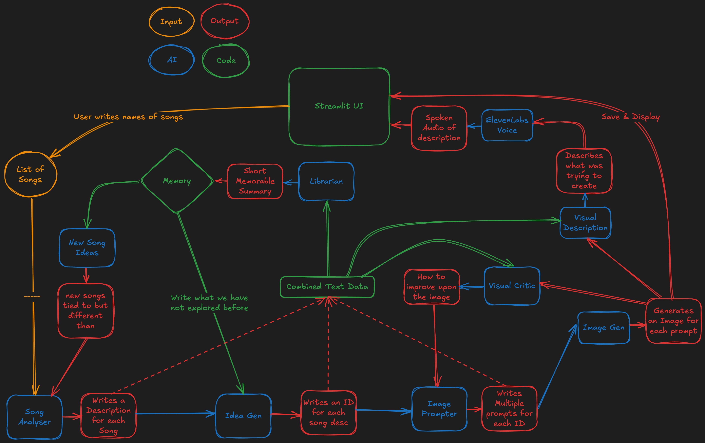

# OZART: AI Music-to-Art Generator

## Overview

Ozart is an autonomous AI artist that interprets songs and transforms them into unique visual artworks. By analyzing the emotional and musical characteristics of songs, Ozart creates evocative images that reflect the essence of the music.

**Current Version:** MVP (Music Visualization Pipeline)

## Features

- **Song Analysis:** Analyzes songs via name, Spotify URL, or YouTube link
- **AI Interpretation:** Generates detailed musical interpretation of songs' emotional qualities
- **Artistic Visualization:** Creates unique artwork based on the musical analysis
- **Streamlit Interface:** Simple and elegant user experience for submitting songs and viewing gallery

## How It Works

Ozart follows a sophisticated pipeline to transform music into visual art:

1. **Music Input & Analysis:** Enter a song name or URL to analyze its musical characteristics
2. **AI Interpretation:** The system generates a detailed interpretation of the song's emotional qualities
3. **Image Prompt Creation:** Based on the analysis, an optimized image generation prompt is crafted
4. **Artwork Generation:** The prompt is used to create a unique visual representation
5. **Gallery Display:** All created artworks are displayed in a beautiful gallery interface

## Technical Architecture

Ozart is built with a modular architecture that integrates several AI systems:

- **Frontend:** Streamlit-based UI for user interaction and gallery display
- **Song Analysis:** Uses advanced audio processing and OpenAI's language models
- **Image Generation:** Leverages Replicate and Flux image generation technologies
- **Metadata Management:** Sophisticated tracking of artwork/song relationships

## Technology Stack

- **AI/ML:** OpenAI API for text analysis and prompt generation
- **Image Generation:** Replicate and Flux for high-quality image creation
- **Frontend:** Streamlit for intuitive user interface
- **Backend:** Python with threading for efficient parallel processing
- **Data Storage:** JSON-based metadata and file system for images and analyses

## Project Roadmap

Ozart is being developed in phases:

### Phase 1: MVP Implementation (Current)
- Music analysis from song titles/URLs
- Basic text-to-image pipeline
- Storage of generations for evaluation

### Phase 2: Enhanced Music Processing
- Incorporate lightweight models for raw audio analysis
- Improve image refinement with deeper feedback
- Expand memory functions for iterative learning

### Phase 3: Full Autonomy & Scaling
- AI-driven critique and scoring system
- Multi-agent collaboration for sophisticated iterations
- Expanded API support for deeper music-image correlations

## Getting Started

1. Clone the repository
2. Install required dependencies
3. Set up API keys for OpenAI, Replicate, and other services
4. Run the Streamlit interface
5. Enter song names or URLs to generate artwork

## Examples

Ozart can create varied artistic interpretations based on different musical styles:

- Classical compositions become elegant, structured visual pieces
- Hip-hop tracks transform into vibrant, dynamic artwork
- Ambient music generates atmospheric, ethereal visuals
- Rock songs produce bold, energetic compositions

## Limitations

The current MVP version has some limitations:

- Relies primarily on song metadata rather than direct audio analysis
- Single image generation per song (future versions will explore multiple interpretations)
- Limited refinement capabilities (iterative improvement coming in future versions)

## Contributing

Contributions to Ozart are welcome! Whether you're interested in improving the music analysis, enhancing the image generation, or refining the user interface, please feel free to submit pull requests.

## License

MIT

## Acknowledgments

- OpenAI for powerful language models
- Replicate and Flux for image generation capabilities
- OpenSmile for audio analysis
- The broader AI art and music community for inspiration

---

*Ozart: Where music becomes visual art through the lens of artificial intelligence* 